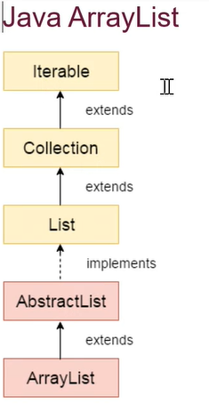

Array List is dynamically expandable or reduceable. ArrayList can also have duplicate elements. We can access random elements. ArrayList cannot be made using primitive types i.e., int, char, double, etc. We need to use Wrappper class of this int class i.e, Integer, likewise - float - Float, char- Character, string - String. 


Syntax: 

```
ArrayList <Non_Primitive_Data_Type> obj = new ArrayList<Non_Primitive_Data_Type>();
```

Declaration: 

```
public class ArrayList<E> extends AbstractList<E> implements List<E>{}
```

Constructors:

ArrayList();

ArrayList(Collection<? Extends E>);

ArrayList(int capacity);


Methods:

add(E element); - adds element to the end of the list
add(int index, E element); - adds element at the specified index
addAll(Collection<? Extends E>); - adds all elements of the collection to the end of the list
addAll(int index, Collection<? Extends E>); - adds all elements of the collection at the specified index
clear(); - removes all elements from the list
contains(Object o); - returns true if the list contains the specified element
ensureCapacity(int minCapacity); - increases the capacity of the list to the specified minimum capacity
isEmpty(); - returns true if the list is empty
remove(int index); - removes the element at the specified index
get(int index); - returns the element at the specified index
set(int index, E element); - replaces the element at the specified index with the specified element
size(); - returns the number of elements in the list


