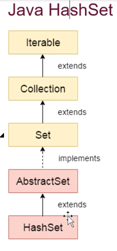

Java HashSet:

HashSet is a class which implements Set interface.

Hashset is a class which implements Set interface.
Hashset cannot contain duplicate elements, only unique elements.
Hashset allows null values.
Hashset is not synchronized.