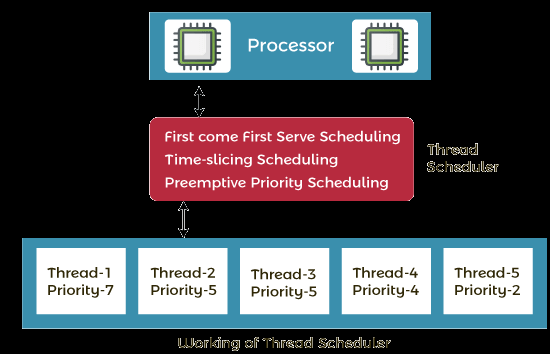

Thread Scheduler in java:
2 Factors:

1. Priority
2. Time of arrival

Priority:
1 to 10
1 is lowest priority
If a thread have higher prioirity then it will get the chance to execute first.
10 is highest priority

Time of arrival:

If two threads have same priority then the thread which came first will get the chance to execute first.
Let us suppose A(5) and B(5) have same priority then if A came first then A will get the chance to execute first and B should wait.

Thread Scheduler is a part of JVM. Follows Time Slicing Algorithm. or Round Robin Algorithm or FIFO Algorithm.

Threads                  Arrival Time
t1(5)                    0
t2(5)                    1
t3(5)                    2
t4(5)                    3
t5(5)                    4

t1(5) will get the chance to execute first and then t2(5) and so on.

Time Slicing Algorithm:

Usually Premptive FIFO Algorithm is used in OS, but some threads may not get chance to be executed and they may starve and die. So to avoid this problem Time Slicing Algorithm is used.

Time Slice is the time given to a thread to execute.
Time Slice is 1 ms.
Time Slice is not fixed. It is dynamic.

Threads                 Arrival Time           Time to execute
t1(5)                   0                       10
t2(5)                   1                       10
t3(5)                   2                       10
t4(5)                   3                       10
t5(5)                   4                       10

Assuming that Time slice is 5 ms. Then t1(5) will execute for 5 ms and then t1(5) will still have 5ms left, t2(5) will execute for 5 ms and so on.

