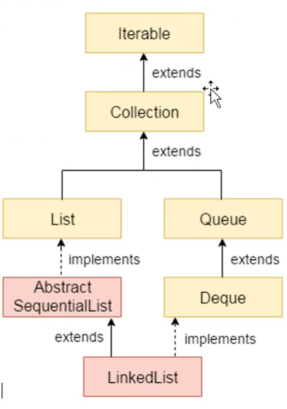
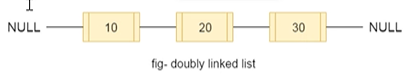

Linked List:
Linked List is a linear data structure. Unlike arrays, linked list elements are not stored at a contiguous location; the elements are linked using pointers.

There are various types of linked list:
1. Singly Linked List
2. Doubly Linked List
3. Circular Linked List

Methods:
boolean add(E e) - Appends the specified element to the end of this list.
void add(int index, E element) - Inserts the specified element at the specified position in this list.
boolean addAll(Collection<? extends E> c) - Appends all of the elements in the specified collection to the end of this list, in the order that they are returned by the specified collection's iterator.
boolean addAll(int index, Collection<? extends E> c) - Inserts all of the elements in the specified collection into this list, starting at the specified position.
void addFirst(E e) - Inserts the specified element at the beginning of this list.
void addLast(E e) - Appends the specified element to the end of this list.
void clear() - Removes all of the elements from this list.
Object clone() - Returns a shallow copy of this LinkedList.
boolean contains(Object o) - Returns true if this list contains the specified element.
Iterator<E> descendingIterator() - Returns an iterator over the elements in this deque in reverse sequential order.
E element() - Retrieves, but does not remove, the head (first element) of this list.

