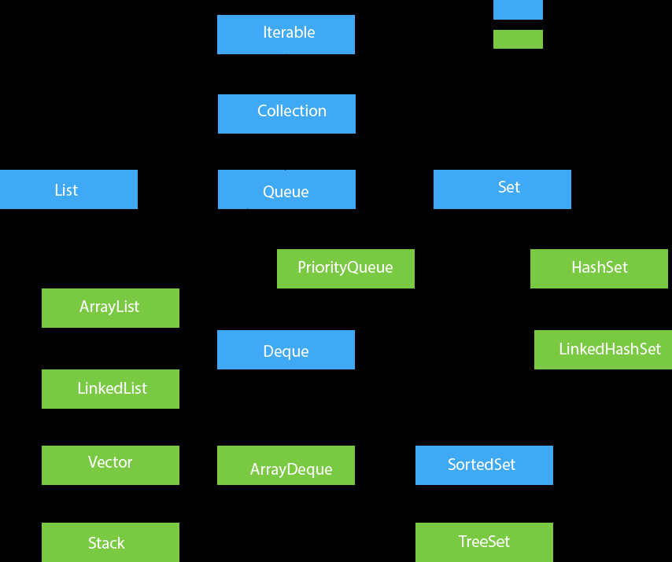

Why Collection Framework was introduced in Java?

- To reduce the complexity of programming.
- To improve the performance.
- To reduce the effort in coding by providing already tested and reusable data structures.
- To provide high performance data structures for searching, sorting, and manipulating data.

Java Collection Framework is also knowns as single unit of objects.

Types of Collection Framework classes:

1. List class
2. Set class
3. Map class

Collection represents single unit of objects, i.e. a group.
Framework represents ready made architecture.

Collection Framework is a combination of classes and interfaces which are used to store and manipulate a group of objects.

Collection Framework is introduced in JDK 1.2 version.

Things provided in Collection Framework:

1. Interfaces
2. Classes
3. Algorithms

1. Iterator interface

   - It is used to iterate the elements in the collection.
   - It iterates the elements in the forward direction only.
   - It is applicable for all collection classes.
   - It is a universal cursor.

   Example:
   1. Traditional way of iterating the elements in the collection.
   for(int i=0; i<list.size(); i++) {
   System.out.println(list.get(i));
   }
   2. Using Iterator interface
   Iterator itr = list.iterator();
   while(itr.hasNext()) {
   System.out.println(itr.next());
   }

   There are 3 methods in Iterator interface:

   1. public boolean hasNext()
   2. public Object next()
   3. public void remove()
2. Collection Interface

List Interface

<<<<<<< HEAD
List`<data-type>` list = new ArrayList`<data-type>`();

List `<data-type>` list = new LinkedList `<data-type>`();
List `<data-type>` list = new Vector `<data-type>`();
List `<data-type>` list = new Stack `<data-type>`();

Set Interface

Set`<data-type>` set = new HashSet`<data-type>`();

Set `<data-type>` set = new LinkedHashSet `<data-type>`();

Set `<data-type>` set = new TreeSet `<data-type>`();
=======
List<data-type> list = new ArrayList<data-type>();
    
List<data-type> list = new LinkedList<data-type>();

List<data-type> list = new Vector<data-type>();

List<data-type> list = new Stack<data-type>();

Set Interface

Set<data-type> set = new HashSet<data-type>();
    
Set<data-type> set = new LinkedHashSet<data-type>();
    
Set<data-type> set = new TreeSet<data-type>();
>>>>>>> 08f4e7d57299fe24b89f22ea290bf49dc7ef38ac

Map Interface

Map<data-type, data-type> map = new HashMap<data-type, data-type>();
    
Map<data-type, data-type> map = new LinkedHashMap<data-type, data-type>();
    
Map<data-type, data-type> map = new TreeMap<data-type, data-type>();
    

Queue Interface

<<<<<<< HEAD
Queue`<data-type>` queue = new PriorityQueue`<data-type>`();
Queue`<data-type>` queue = new ArrayDeque`<data-type>`();
=======
Queue<data-type> queue = new PriorityQueue<data-type>();
    
Queue<data-type> queue = new ArrayDeque<data-type>();

>>>>>>> 08f4e7d57299fe24b89f22ea290bf49dc7ef38ac
