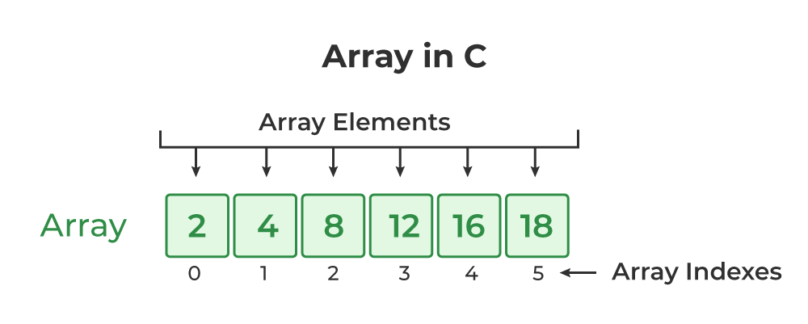

To store a variable in java:
datatype variableName = value;

```
String car1= "BMW";
String car2="Rolls Royce";
String car3="Lamborghini";
String car4="Ferrari";
String car5="Maserati";
```

...

Like this we would store all values for eternity.
But what if we want to store 1000 values?
We would have to write 1000 lines of code.
This is where arrays come in handy.

Array is a special variable. It can hold more than one value at a time.
Arrays are used to store multiple values in a single variable with same datatype, instead of declaring separate variables for each value.

Array stores all the values in contegous addresses.

To declare an array in java:

```
datatype[] arrayName = new datatype[size];
datatype arrayName[] = new datatype[size];
datatype arrayName[] = {value1,value2,value3,...};
```

with "[]" we tell java that this is an array.
"new" is used to create an array.

String[] cars = new String[5];
cars={"BMW","Rolls Royce","Lamborghini","Ferrari","Maserati"};

Advantages:

1. Code Optimization
2. Random selection of data (using Index position)

Disadvantages:

1. Size Limit at the time of intialization. (it doesnt grow as we add values to it).

Now we can access the values of the array using the index of the value.
Index of an array starts from 0.

```
System.out.println(cars[0]); //prints BMW
System.out.println(cars[1]); //prints Rolls Royce
System.out.println(cars[2]); //prints Lamborghini
```

To push variables in array:
arrayName[index]=value;

```
cars[3]="Audi";
```

There are two types of an array:

1. Single Dimensional : Basic array declaration

   
2. Multi Dimensional  : For graphs, Matrices and etc.
