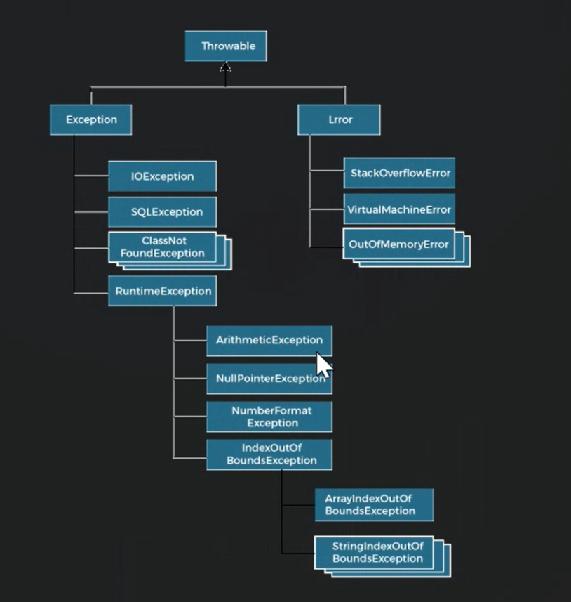
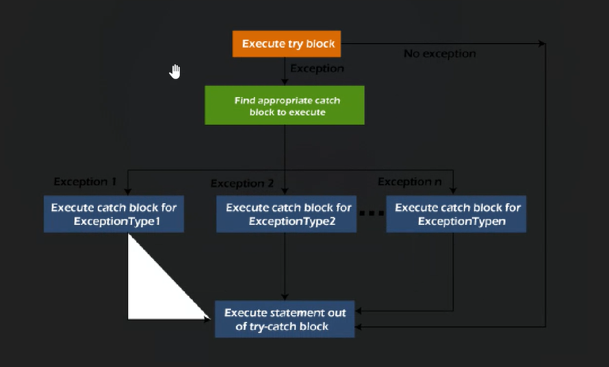

Exception Handling:
 An abnormal condition that occurs during the execution of a program is called an exception.
 Happens during runtime.

What happens if we dont care about execptions:

Statement1
Statement2
Statement3 // Error occurs here aka Exception
Statement4 // This statement will not be executed
Statement5 // This statement will not be executed
Statement6 // This statement will not be executed

Types of Exceptions:

1. Checked Exceptions: Checked at compile time. Ex: IOException, SQLException
2. Unchecked Exceptions: Checked at runtime. Ex: ArithmeticException, NullPointerException
3. Error: Checked at runtime. Ex: OutOfMemoryError, StackOverflowError

Keywords used in Exception Handling:

1. Try: Contains set of statements where an exception can occur.
2. Catch: Contains set of statements which will be executed if an exception occurs in try block.
3. Finally: Contains set of statements which will be executed irrespective of exception.
4. Throw: Used to throw an exception explicitly.
5. Throws: Used to declare an exception.

Senarios:

1. ArithmeticException: Occurs when we divide a number by zero.
   if a=10/0 then ArithmeticException will occur.
2. NullPointerException: Occurs when we refer to the members of a null object.
   if a=null then a.toString() will throw NullPointerException.
3. NumberFormatException: Occurs when we try to convert a string into a numeric value.
   if a="ten" then Integer.parseInt(a) will throw NumberFormatException.
4. ArrayIndexOutOfBoundsException: Occurs when we refer to an array index which is out of range.
   if a[5] but the size of the a={1,2,3,4} then ArrayIndexOutOfBoundsException will occur.

Exception Hierachy:

Multiple try and throw blocks, Heirarchy:

